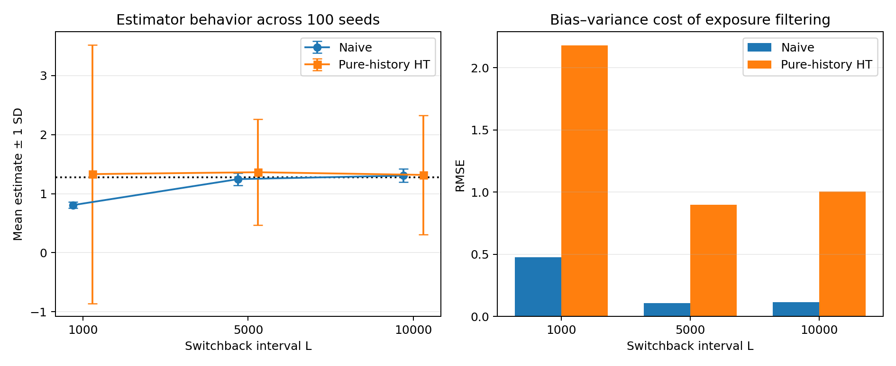
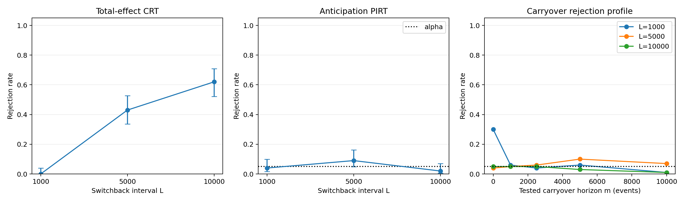

# Finite-Sample Randomization Inference for Switchback Rideshare Experiments

This project studies how the switchback interval affects causal-effect estimation
and randomization-based inference in a dynamic ridesharing environment with
carryover.

> **Research question:** When treatment changes can persist through the platform
> state, how should the switchback interval be chosen to balance carryover bias,
> estimator variance, statistical power, and the need to update policies frequently?

## Main findings

The final experiment contains 100 independent simulator trajectories for each
switchback interval, with 500,000 events per trajectory and 2,000 Monte Carlo
resamples per randomization test.

| Switchback interval L | Naive bias | Naive RMSE | Pure-history share | Total-effect CRT rejection rate |
| ---: | ---: | ---: | ---: | ---: |
| 1,000 | -0.473 | 0.475 | 3.2% | 0% (0/95 available tests) |
| 5,000 | -0.032 | 0.107 | 50.0% | 43% |
| 10,000 | 0.027 | 0.114 | 75.2% | 62% |

The Monte Carlo reference effect under sustained treatment versus control is **1.2784**.

- Frequent switching at \(L=1000\) produces severe downward bias because outcomes
  remain contaminated by earlier assignments.
- Increasing \(L\) to 5,000 or 10,000 nearly eliminates the naive estimator's bias.
- Pure-history Horvitz--Thompson estimation reduces exposure contamination but has
  substantially larger finite-sample variance.
- The total-effect CRT has almost no usable randomized sections at \(L=1000\), but
  its empirical power rises to 43% and 62% at \(L=5000\) and \(L=10000\).
- Across all 300 anticipation tests, the rejection rate is exactly 5%, consistent
  with nominal size in a simulator without anticipatory behavior.





## Experimental design

| Component | Specification |
| --- | --- |
| Simulator | XP-Gym rideshare pricing environment |
| Events per trajectory | 500,000 |
| Switchback intervals | 1,000; 5,000; 10,000 events |
| Independent replications | 100 seeds per interval (1000--1099) |
| Treatment probability | 0.5 at the block level |
| Assumed carryover memory | 5,000 events |
| Carryover horizons tested | 0; 1,000; 2,500; 5,000; 10,000 events |
| Randomization resamples | 2,000 per test |
| Primary outcomes | Bias, RMSE, rejection rate, usable randomized units |

The same seed index is used across the three interval settings to support paired
comparisons. Randomization seeds inside the tests are deterministically derived
from the experiment specification.

## Statistical methods

### Effect estimation

- **Naive difference in means:** compares average rewards under treatment and
  control without adjusting for history.
- **Pure-history Horvitz--Thompson estimator:** uses events whose most recent
  \(m+1\) assignments are entirely treatment or entirely control and weights them
  by their exact switchback exposure probabilities.

### Randomization tests

- **Total-effect CRT:** tests a partially sharp outcome-invariance null on focal
  events in constant-assignment sections, using a one-sided positive-tail comparison.
- **Carryover CRT:** tests whether treatment carryover lasts beyond a candidate
  horizon \(m\).
- **Anticipation PIRT:** checks whether present outcomes appear to depend on future
  assignments; in this application it functions as a diagnostic check.

Rejection of a carryover null provides evidence against that candidate horizon.
Failure to reject does not prove that carryover is absent. The horizon grid is
therefore treated as a diagnostic profile rather than a point estimator.

## Installation

> **Configuration note:** The YAML files in `configs/` document the settings only.
> The current project scripts use command-line arguments and do not load these
> files automatically. Editing them alone will not change a run.
> XP-Gym's upstream ATE script separately uses Hydra configuration.

Download and extract this project locally. With Python 3.11 installed, open
PowerShell in the project folder containing `pyproject.toml` and run:

```powershell
python -m venv .venv
Set-ExecutionPolicy -Scope Process -ExecutionPolicy RemoteSigned
.\.venv\Scripts\Activate.ps1
python -m pip install --upgrade pip
python -m pip install -e ".[dev]"
```

This is sufficient for the synthetic validation and benchmark below. Run their
commands from this project folder. For rideshare simulation, also complete the
XP-Gym setup below.

## Validation and Benchmarking

### Synthetic validation

This experiment generates outcomes with known null and alternative mechanisms
for total effects, carryover, and anticipation. Repeated tests estimate false
rejection rates under the null and detection rates under the alternative.

```powershell
python scripts/run_synthetic_validation.py --replications 200 --resamples 2000 --output-dir results/reproduced_validation
```

**Outputs** — saved to `results/reproduced_validation/`:

- **`synthetic_pvalues.csv`:** one p-value per replication and test scenario.
- **`synthetic_summary.csv`:** replication counts, rejection rates, and mean
  p-values by scenario. Null rejection rates assess false positives; alternative
  rejection rates assess detection power.

The published calibration summary is in `results/validation/`.

This is an empirical calibration check, not a proof of validity. Its output is
not used as input to the rideshare experiment.

### Pure-history benchmark

The benchmark compares a direct history-window scan, O(Tm), with a sliding-window
implementation, O(T). Both identify pure-A and pure-B histories. It checks that
their outputs agree and measures runtime and speedup.

```powershell
python scripts/benchmark_pure_history.py --output results/reproduced_benchmarks/pure_history_runtime.csv
```

**Output** — `results/reproduced_benchmarks/pure_history_runtime.csv`:

- **`n_events`, `memory`:** trajectory length and history-window setting.
- **`naive_seconds`, `linear_seconds`:** runtime of the direct and optimized scans.
- **`speedup`:** direct-scan runtime divided by optimized-scan runtime.

The slow implementation is skipped at the largest setting; its runtime and
speedup are recorded as missing, not as zero.

The benchmark measures computational performance, not statistical power. It is
optional when rerunning the main experiment.

## Running the XP-Gym Experiment

### 1. Set up the XP-Gym environment

Download and extract [XP-Gym](https://github.com/atzheng/xp_gym), open
PowerShell in the XP-Gym folder containing `pyproject.toml` and run:

```powershell
poetry install
poetry run python -c "import xp_gym, jax; print('XP-Gym OK'); print('JAX:', jax.__version__)"
Set-ExecutionPolicy -Scope Process -ExecutionPolicy RemoteSigned
Invoke-Expression (poetry env activate)
```

The execution-policy setting applies only to the current PowerShell session.
After activation, the prompt should show `(xp-gym-py3.11)` or a similar name.

Checked setup: **Python 3.11.9, Poetry 2.3.2, JAX 0.5.2, CPU**. No GPU is required.

### 2. Validate trajectory generation

Check that the compiled `jax.lax.scan` rollout matches the reference Python loop:

```powershell
python scripts/check_xp_gym_rollout.py --n-steps 1000 --switch-every 1000 --seed 2026 --compare-python-loop
```

Then check generation at the full trajectory length:

```powershell
python scripts/check_xp_gym_rollout.py --n-steps 500000 --switch-every 1000 --seed 2026
```

**Outputs** — JSON reports in `results/rollout_checks/`:

- **Trajectory checks:** event count, finite rewards, binary actions, and
  assignment consistency within blocks.
- **Reproducibility checks:** identical runs with the same seed and changed
  trajectories with a different seed.
- **Loop comparison:** the short run checks actions and rewards against the
  reference Python loop.
- **Timing:** compilation/first-run and cached execution times.

Check for `all_checks_passed: true` before generating the full experiment.

### 3. Compute the reference ATE

Run XP-Gym's [compute-ate.py](https://github.com/atzheng/xp_gym/blob/main/scripts/compute-ate.py)
from the **XP-Gym root**, using its Hydra configuration:

```powershell
cd ../xp_gym
poetry run python scripts/compute-ate.py
```

**Output:** a local CSV containing average rewards under sustained policies
`A` and `B`, and the terminal summary:

```text
Average ATE (B - A): 1.278397
```

Use `--true-ate 1.278396906` to reproduce the published bias and RMSE. If computing
a new reference, pass the new value instead. It does not enter the p-value
calculations.


### 4. Generate multi-seed trajectories

After the upstream ATE calculation, return to this project's root in the same
terminal:

```powershell
cd ../switchback-rideshare-public
```

The script defaults to 500,000 events, L = 1,000 / 5,000 / 10,000, seed start
1000, and memory 5,000. Set `--seed-count 100` explicitly: its default is only 2.

```powershell
python scripts/generate_xp_gym_multiseed.py --seed-count 100
```

**Outputs** — saved to `data/generated/`:

- **300 NPZ trajectories:** 100 per interval, in `L1000/`, `L5000/`, and
  `L10000/`. Each file stores event-level `action` and `reward` arrays.
- **`manifest.csv`:** one row per trajectory, including its seed, interval,
  naive and pure-history HT estimates, pure-history share, and runtime.

Keep `manifest.csv` with the trajectories; the analysis script uses it to
calculate estimator summaries.

The generator saves each completed trajectory and skips existing files when
resumed. If changing the environment or experimental settings, use a new data
directory rather than mixing runs under existing filenames.

### 5. Run inference and summarize estimates

Analyze the generated trajectories using:

```powershell
python scripts/run_multiseed_inference.py --output-dir results/reproduced --true-ate 1.278396906
```

Results are saved to `results/reproduced/`. The script produces:

- **Test results:** per-trajectory p-values and rejection-rate summaries for
  total-effect CRT, anticipation PIRT, and five carryover horizons.
- **Estimation summaries:** mean estimates, SD, bias, and RMSE by interval.
- **Two figures**, described below.

1. **Estimator performance (`estimation_performance.png`)**

   - Compares naive and pure-history HT mean estimates across intervals, with ±1 SD error bars.
   - Includes the reference ATE as a dotted line.
   - Shows RMSE to compare overall estimation accuracy.

2. **Randomization inference (`randomization_inference.png`)**

   - Compares total-effect and anticipation rejection rates across intervals.
   - Shows carryover rejection rates across candidate memory horizons.
   - Includes 95% Wilson intervals for total-effect and anticipation rates, and 5% reference lines for anticipation and carryover.

Published results are in `results/final/`. Use a fresh output directory to
recompute tests rather than reuse saved records.

## Outputs

| File | Contents |
| --- | --- |
| `data/generated/manifest.csv` | One row per trajectory, including effect estimates and file metadata |
| `results/reproduced/inference_results.csv` | 2,100 test records, including statistics, p-values, and unavailable cases |
| `results/reproduced/inference_summary.csv` | Rejection rates, available counts, and uncertainty summaries |
| `results/reproduced/estimation_summary.csv` | Estimator means, SD, bias, and RMSE by interval |
| `results/reproduced/estimation_performance.png` | Estimation comparison |
| `results/reproduced/randomization_inference.png` | Randomization-inference comparison |

## Limitations

- Results describe one simulated rideshare environment and parameter setting;
  they are not causal claims about a real platform.
- The reference ATE has Monte Carlo uncertainty, and a chosen history window
  need not capture all of the simulator's dynamic dependence.
- Only three switchback intervals are evaluated.
- A carryover rejection profile does not identify an exact structural memory
  length.
- Total-effect CRT availability depends on realized constant-assignment sections;
  five \(L=1000\) trajectories had no usable section and are reported as
  unavailable rather than discarded.
- The carryover horizon grid is exploratory and is not adjusted for family-wise
  multiple testing.

## Attribution

The ridesharing simulator is adapted from the MIT-licensed
[XP-Gym](https://github.com/atzheng/xp_gym) project associated with:

- Farias, Li, Peng, and Zheng, *Markovian Interference in Experiments*,
  [arXiv:2206.02371](https://arxiv.org/abs/2206.02371).

The pairwise randomization-test ideas are based on:

- Zhong, *Unconditional Randomization Tests for Interference*,
  [arXiv:2409.09243](https://arxiv.org/abs/2409.09243).

Third-party source files and paper PDFs are intentionally not redistributed in
this repository.
